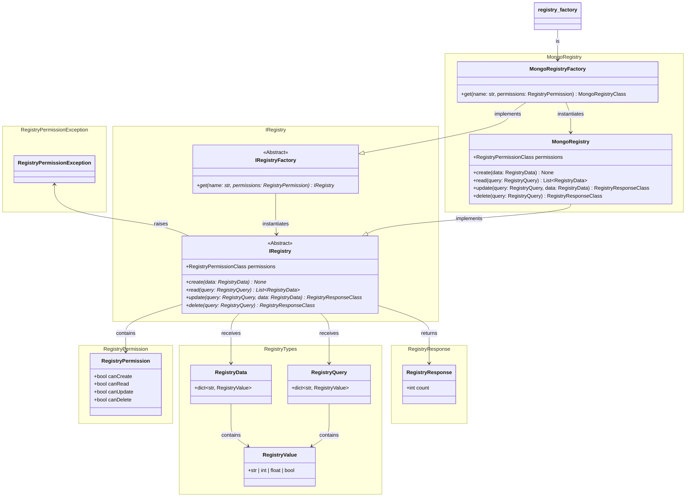

# Registry module

> [!WARNING]
> At the moment, GitHub does not support `namespace` in Mermaid, so to view the diagram correctly, you should use Mermaid from version 10.2.0

```mermaid
classDiagram
    namespace RegistryResponse {
        class RegistryResponseClass["RegistryResponse"] {
            +int count
        }
    }

    namespace RegistryPermission {
        class RegistryPermissionClass["RegistryPermission"] {
            +bool canCreate
            +bool canRead
            +bool canUpdate
            +bool canDelete
        }
    }

    namespace RegistryPermissionException {
        class RegistryPermissionExceptionClass["RegistryPermissionException"]
    }

    namespace RegistryTypes {
        class RegistryValue {
            +str | int | float | bool
        }
        class RegistryData {
            +dict~str, RegistryValue~
        }
        class RegistryQuery {
            +dict~str, RegistryValue~
        }
    }

    namespace IRegistry {
        class IRegistryClass["IRegistry"] {
            <<Abstract>>
            +RegistryPermissionClass permissions
            +create(data: RegistryData) None*
            +read(query: RegistryQuery) List~RegistryData~*
            +update(query: RegistryQuery, data: RegistryData) RegistryResponseClass*
            +delete(query: RegistryQuery) RegistryResponseClass*
        }

        class IRegistryFactory {
            <<Abstract>>
            +get(name: str, permissions: RegistryPermission) IRegistry*
        }
    }

    namespace MongoRegistry {
        class MongoRegistryClass["MongoRegistry"] {
            +RegistryPermissionClass permissions
            +create(data: RegistryData) None
            +read(query: RegistryQuery) List~RegistryData~
            +update(query: RegistryQuery, data: RegistryData) RegistryResponseClass
            +delete(query: RegistryQuery) RegistryResponseClass
        }
        class MongoRegistryFactory {
            +get(name: str, permissions: RegistryPermission) MongoRegistryClass
        }
    }

    RegistryData --> RegistryValue : contains
    RegistryQuery --> RegistryValue : contains

    IRegistryFactory --> IRegistryClass : instantiates
    RegistryPermissionExceptionClass <-- IRegistryClass : raises
    IRegistryClass --> RegistryPermissionClass : contains
    IRegistryClass --> RegistryData : receives
    IRegistryClass --> RegistryQuery : receives
    IRegistryClass --> RegistryResponseClass : returns

    MongoRegistryClass --|> IRegistryClass : implements
    MongoRegistryFactory --|> IRegistryFactory : implements
    MongoRegistryFactory --> MongoRegistryClass : instantiates

    registry_factory --> MongoRegistryFactory : is
```
